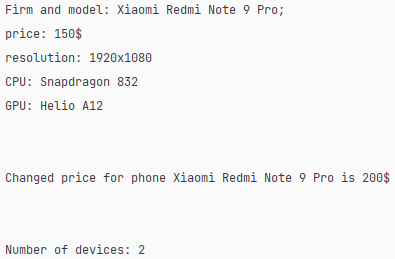

Львівський національний університет природокористування

Факультет механіки, енергетики та інформаційних технологій

Кафедра інформаційних технологій

Звіт з лабораторної роботи №6
на тему: 

# Змінні класу та об'єкта

Виконав: ст. групи ІТ-12сп Тучапський Д. Ю.

Перевірив: Татомир А. В.

**Мета роботи:** ознайомитися з різними типами змінних в об'єктно-орієнтованому програмуванні.

## Завдання
1. Набути навичок у створенні класів. Створити клас, який приймає декілька аргументів. На їх основі у конструкторі класу створити набір атрибутів обєєкта (класу), один з яких створюється на основі інших. 
2. Реалізувати метод, який генерує опис об'єкта на основі його властивостей.
3. Навчитися створювати об'єкти. Створити декілька об'єктів на основі класу. Викликати реалізований метод, використовуючи об'єкт і клас. 
4. Познайомитися з поняттям змінної класу. Реалізувати змінну класу і метод, що її використовує. 
5. Реалізувати лічильник створених за допомогою класу об'єктів.

## Хід роботи
1. Набув навичок у створенні класів, створив клас, що приймає декілька аргументів (firm, price, model, resolution, cpu, gpu). На їх основі у конструкторі класу створив набір атрибутів об'єкта (класу), один з яких створився на основі інших (short_description).
2. Реалізував метод, який генерує опис об'єкта на основі його властивостей (full_description).
3. Навчився створювати об'єкти (computer_1, phone_1), створив декілька об'єктів на основі класу, викликав реалізований метод, використовуючи об'єкт і клас.
4. Познайомився з поняттям змінної класу, реалізував змінну класу і метод, що її використовує (rising_prices, apply_rising()).
5. Реалізував лічильник створених за допомогою класу об'єктів.

[Код.](./main.py)

**Висновок:** я створив клас, конструктор класу, методи, об'єкти класу, змінну класу і метод, що її використовує. В результаті я отримав клас, з інформацією про різновиди телефонів, в якому є методи, що дають можливість подивитись на ці створені телефони, за допомогою об'єктів. Я навчився створювати клас, об'єкти, методи, змінні класу і методи що їх використовують.