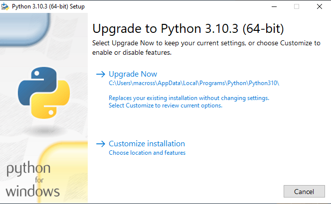
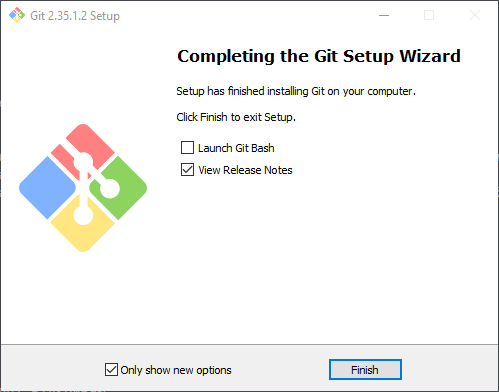
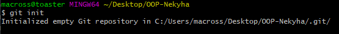
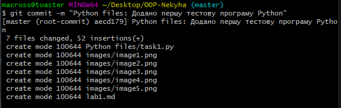
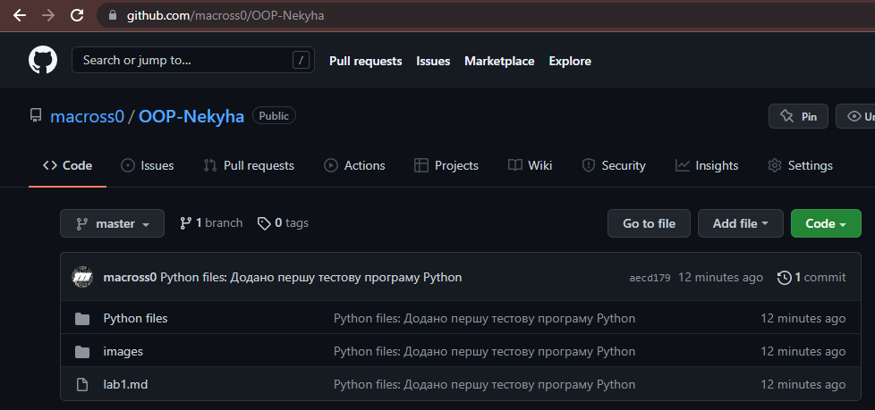

Львівський національний університет природокористування

Факультет механіки, енергетики та інформаційних технологій

Кафедра інформаційних технологій

Звіт з лабораторної роботи №1

на тему: 
 # Вступне заняття. Налаштування середовища розробки Python 3 і запуск програм

Виконав: студент групи ІТ-31 Некига М.І.

Перевірив: Татомир А. В.

**Мета роботи:** ознайомитися з інструментарієм розробки веб-додатків.

 ## Завдання
1. Навчитися встановлювати середовище розробки Python 3 в різних операційних системах і запускати програми.
2. Написати базову програму згідно виданого завдання та проаналізувати її роботу.
3. На прикладі написаної програми навчитися застосовувати систему Git для контролю версій програмного забезпечення.

 ## Хід роботи
1. Встановлюю (оновлюю) Python 3.10.3.

    

2. Встановлюю Git.

    

3. Створюю папку з іменем OOP-Nekyha, у цій папці через контекстне меню відкриваю комндний рядок Git Bash.

4. Ініціалізую у папці репозиторій Git ввівши наступну команду:

        git init

    

5. В редакторі коду створюю новий файл та записую у нього код тестової програми. Зберігаю файл у папці "Python files" у директорії репозиторію.

    

6. Запускаю створений файл у командному рядку:

        python 'Python files/task1.py'

    

7. Зберігаю зміни в репозиторії. Для цього спочатку додаю усі нові файли до списку відстежуваних:

        git add *

    Створюю новий запис в історії змін репозиторію. Вказую короткий та зрозумілий опис змін у назву.

        git commit -m "Python files: Додано першу тестову програму Python"

    Аргумент **-m** каже системі контролю версій, що після цього йде повідомлення, пов'язане із зміною.

    

8. Відправляю репозиторій у віддалене сховище (в данному випадку Github). Спочатку створюю репозиторій у своєму профілі Github та копіюю посилання на нього.

9. Додаю віддалене сховище до локального репозиторію:

        git remote add origin https://github.com/macross0/OOP-Nekyha

    * **origin** служить назвою віддаленого репозиторію. Назва може бути довільною.

10. Відправляю усі зміни до віддаленого репозиторію:

        git push --set-upstream origin master

    * **master** - ім'я основної гілки проекту.

    

11. Переходжу за посиланням репозиторію та перевіряю наявність відправлених з локального репозиторію файлів.

    

**Висновок:** під час виконання лабораторної роботи я ознайомився з інструментарієм розробки веб-додатків та вивчив основи роботи із системою контролю версій Git.