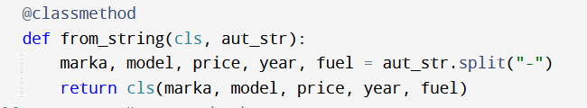

Львівський національний університет природокористування 

Факультет механіки, енергетики та інформаційних технологій 

Кафедра інформаційних технологій 

Звіт з лабораторної роботи №7 

на тему: 
# Використання методів класу і статичних методів

Виконав: студент групи Іт-31 Некига М. І.

Перевірив: Татомир А. В. 

**Мета роботи:** Полягає в ознайомленні з різними типами методів у об’єктно-орієнтованому програмуванні

## Завдання
1. Засвоїти різницю між звичайними методами, методами класу та статичними методами.
2. Навчитися створювати альтернативні конструктори.
3. Для створеного у попередній роботі класу реалізувати “метод класу”, який повинен працювати зі змінними класу.
4. Реалізувати альтернативний конструктор класу за допомогою методу класу.
5. Створити статичний метод і перевірити його роботу.

## Хід роботи
1. Засвоїв різницю між звичайними методами, методами класу та статичними методами. Звичайний метод класу полягає в тому, що він приймає об'єкт як перший аргумент, а статичний метод ні. 
2. Навчився створювати альтернативні конструктори.

3. Для створеного у попередній роботі класу реалізував “метод класу”, який повинен працювати зі змінними класу.
4. Створив статичний метод і перевірив його роботу. 

**Висновок:** 
Під час виконання лабораторної роботи я засвоїв різницю звичайного та статичного методу, навчився створювати альтернативні конструктори, а також створив статичний метод і перевірив його роботу.
