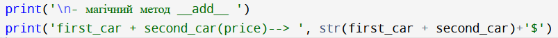
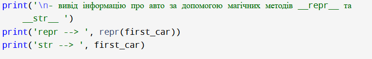
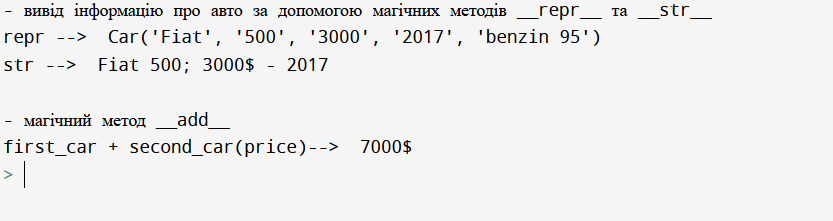

Львівський національний університет природокористування 

Факультет механіки, енергетики та інформаційних технологій 

Кафедра інформаційних технологій 

Звіт з лабораторної роботи №6 

на тему: 
# Поліморфізм в Python 3

Виконав: ст. групи Іт-31 Некига М. І.

Перевірив: Татомир А. В. 

**Мета роботи:** Засвоїти застосування принципу поліморфізму в об’єктно-орієнтованому програмуванні.

## Завдання
1. Ознайомитися з поняттям поліморфізму в ООП.
2. Навчитися перевизначати поведінку методів.
3. Реалізувати декілька “магічних методів” для роботи з визначеними раніше класами.

## Хід роботи
1. Ознайомлююсь з поняттям поліморфізму в ООП.
2. Засвоюю перевизначення поведінки методів.
3. Реалізую декілька методів для роботи з визначеними раніше класами.

**Висновок:**
Під час виконання лабораторної роботи я ознайомився з поняттям поліморфізму в об’єктно-орієнтованому програмуванні.
