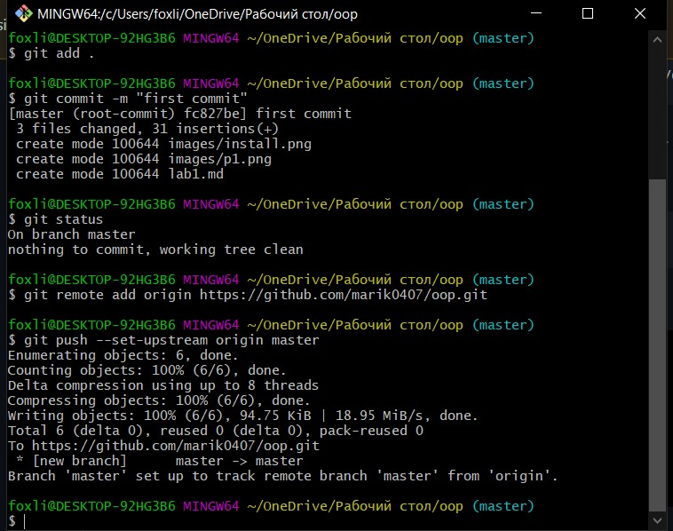

Львівський національний університет природокористування

Факультет механіки, енергетики та інформаційних технологій

Кафедра інформаційних технологій

Звіт з лабораторної роботи №1
на тему: 

# Налаштування середовища розробки Python 3 і запуск програм

Виконав: ст. групи ІТ-12сп Ткачишин М. В.

Перевірив: Татомир А. В.

**Мета роботи:** ознайомитися з інструментарієм розробки веб-додатків.

## Завдання
1. Навчитися встановлювати середовище розробки Python 3 в різних операційних системах і запускати програми.
2. Написати базову програму згідно виданого завдання та проаналізувати її роботу.
3. На прикладі написаної програми навчитися застосовувати систему Git для контролю версій  програмного забезпечення.

## Хід роботи
1. Встановлення середовища розробки Python 3 в операційній системі Windows 10.
 
2. Написав програму, запустив її та проаналізував її роботу. Програма виводить надпис Hello world у консоль за допомогою команди print().

3. Зберіг зміни за допомогою системи контролю версій GIT.
 

**Висновок:** У ході лабораторної роботи №1 я встановив середовище розробки Python 3. Написав свою першу програму, яка виводить надпис Hello world, Навчився базово користуватись GitHub.