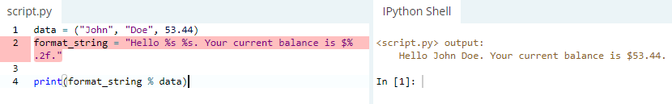

Львівський національний університет природокористування

Факультет механіки, енергетики та інформаційних технологій

Кафедра інформаційних технологій

Звіт з лабораторної роботи №2

на тему: 

# Вивчення простих типів даних і методів роботи з ними у Python 3

Виконав: ст. групи ІТ-12сп Ткачишин М. В.

Перевірив: Татомир А. В.

**Мета роботи:** Типи даних. Базові типи даних в Python 3.
## Завдання 
1. Вивчити основи синтаксису текстів програм в Python 3.
2. Розглянути поняття змінних в Python 3 та засвоїти їх прості типи.
3. Розглянути поняття динамічної типізації.
4. Навчитися здійснювати базові операції та приведення типів. Розв’язати
приклад згідно виданого завдання.
5. Ознайомитися з типом “List”. Навчитися задавати та зчитувати значення
їх елементів. Розв’язати приклад.
6. Ознайомитися основними операторами мови Python 3. Розв’язати завдання.
7. Навчитися основам форматування стрічок і текстового виводу.
8. Освоїти роботу зі стрічками як зі списками (“Lists”).
9. Ознайомитися з типом даних “словник” (“Dictionary”). Розв’язати завдання.
## Хід роботи
1. Вивчаю основи синтаксису Python 3.
2. Ознайомлююся з поняттями змінних та простих типів, розглядаю поняття динамічної типізації.
3. Розв'язую приклад згідно заданого завдання.

4. Ознайомлююся з типом *List* та виконую завдання.

5. Ознайомлююся з основними операторами: -,+,/,[],== та виконую завдання.

6. Розглядаю основи форматування стрічок і текстового виводу.
* %s - рядок (або будь-який об'єкт із рядковим представленням, наприклад числа)
* %d - Цілі числа
* %f – числа з плаваючою комою
* %.<кількість цифр>f – числа з плаваючою комою з фіксованою кількістю цифр праворуч від крапки.
* %x/%X – цілі числа в шістнадцятковому представленні

7. Освоюю роботу зі стрічками як зі списками (*Lists*) та виконую завдання.

8. Ознайомлююся з типом даних “словник” (*Dictionary*) та  виконую завдання.

**Висновок:** Під час виконання лабораторної роботи №2, я вивчив основи синтаксису Python 3, розглянув поняття змінних, поняття динамічної типізації, ознайомився з  типом *List*, типом даних “словник” (*Dictionary*), а також з основними операторами мови Python 3. В результаті чого виконав практичні завдання, де засвоїв свої знання.