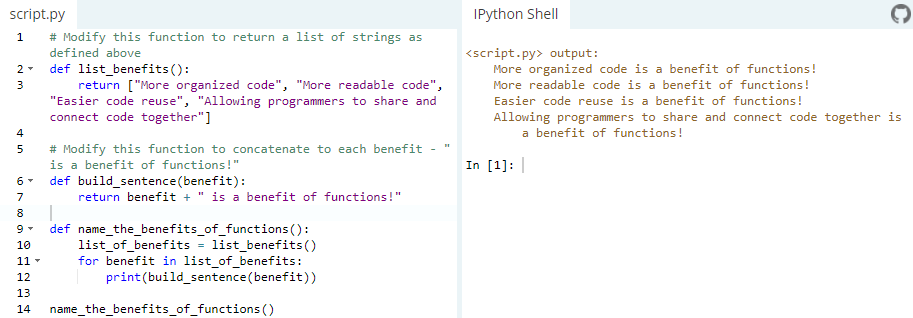

Львівський національний університет природокористування

Факультет механіки, енергетики та інформаційних технологій

Кафедра інформаційних технологій

Звіт з лабораторної роботи №4

на тему: 

# Основи процедурного програмування в Python 3

Виконав: ст. групи ІТ-12сп Ткачишин М. В.

Перевірив: Татомир А. В.

**Мета роботи:** Мета роботи полягає у засвоєнні студентами методів та прийомів роботи
з функціями.

## Завдання
1. Освоїти синтаксис функцій в Python 3.
2. Закріпити поняття параметрів та аргументів функції.
3. Вивчити методи роботи з функціями, викликати функції, передавати їх
в якості параметрів у інші функції (“callback”).
4. Розв’язати заданий приклад.

## Хід роботи
1. Освоюю синтаксис функцій в Python 3.
2. Закріплюю поняття параметрів та аргументів функції.
3. Освоюю методи роботи з функціями, їх викликами та передачу їх
в якості параметрів у інші функції (*callback*).

4. Розв’язую заданий приклад.

**Висновок:** Під час виконання лабораторної роботи я освоїв мотоди роботи з функціями, викликаки функцій, передача їх
в якості параметрів у інші функції, закріпивши ці знання виконашви практичне завдання.