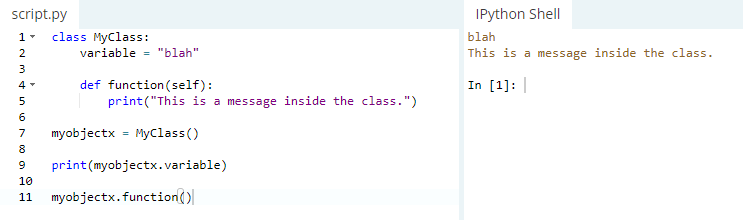
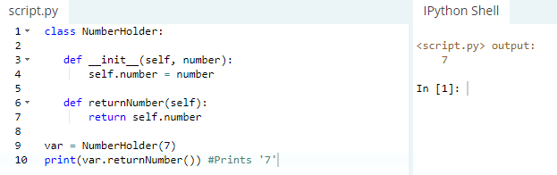
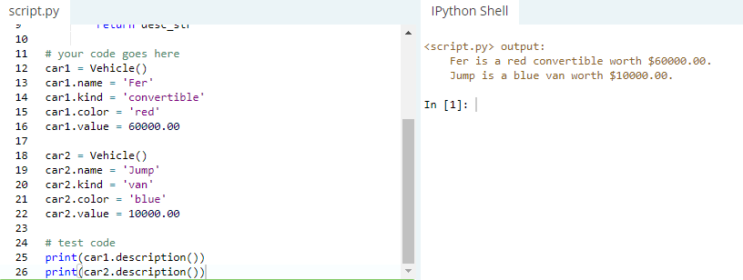

Львівський національний університет природокористування

Факультет механіки, енергетики та інформаційних технологій

Кафедра інформаційних технологій

Звіт з лабораторної роботи №5
на тему: 

# Створення та використання класів

Виконав: ст. групи ІТ-12сп Ткачишин М. В.

Перевірив: Татомир А. В.

**Мета роботи:** ознайомитися з поняттями класів та об’єктів та закріпити на практиці методи їх створення та використання.

## Завдання
1. Навчитися оголошувати класи в Python 3.
2. Навчитися створювати об’єкти (“class instances”).
3. Ознайомитися з поняттям змінної (властивості) класу. Навчитися їх задавати та отримувати їхні значення.
4. Ознайомитися з поняттям функцій об’єкту. Навчитися їх оголошувати та викликати.
5. Розв’язати приклад згідно виданого завдання.

## Хід роботи
1. Ознайомлююсь з оголошенням класів та об'єктів.

2. Ознайомлююсь з поняттям змінної класу та з поняттям функцій об’єкту.

3. Виконую приклад згідно виданого завдання.

**Висновок :** Під час виконання лабораторної роботи я навчився оголошувати класи та створювати обєкти, ознайомився з поняттям змінної класу і поняттям функцій об'єкту.